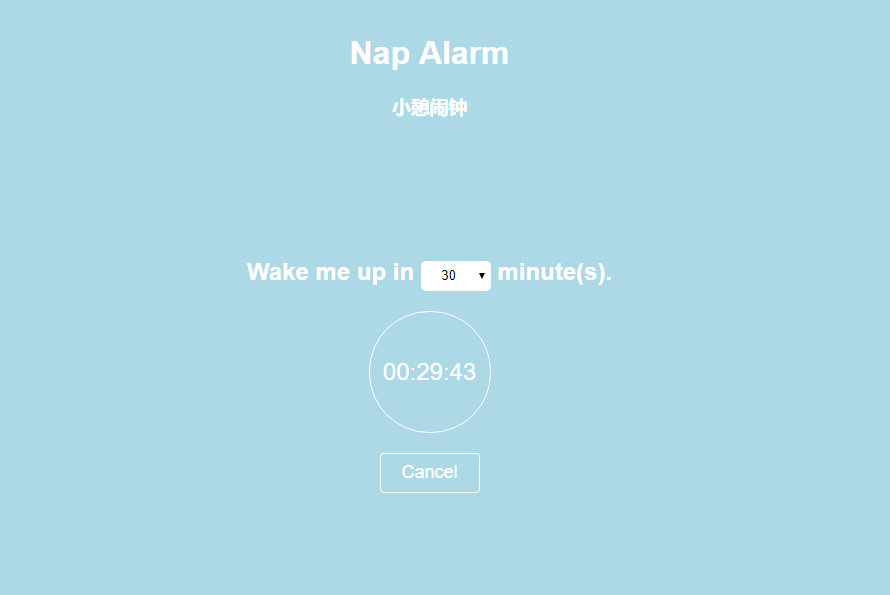

# Nap Alarm
小憩闹钟 - An alarm built with React for your nap!

## Screenshot

## Use
You can check out the online version: [Nap Alarm](https://enzeberg.github.io/nap-alarm/), or run this app locally:

    git clone https://github.com/enzeberg/nap-alarm.git
    cd nap-alarm
    npm install
    npm start

Finally, visit `http://localhost:3000`.

## Note
This app does not support iOS Safari.

## License
MIT
